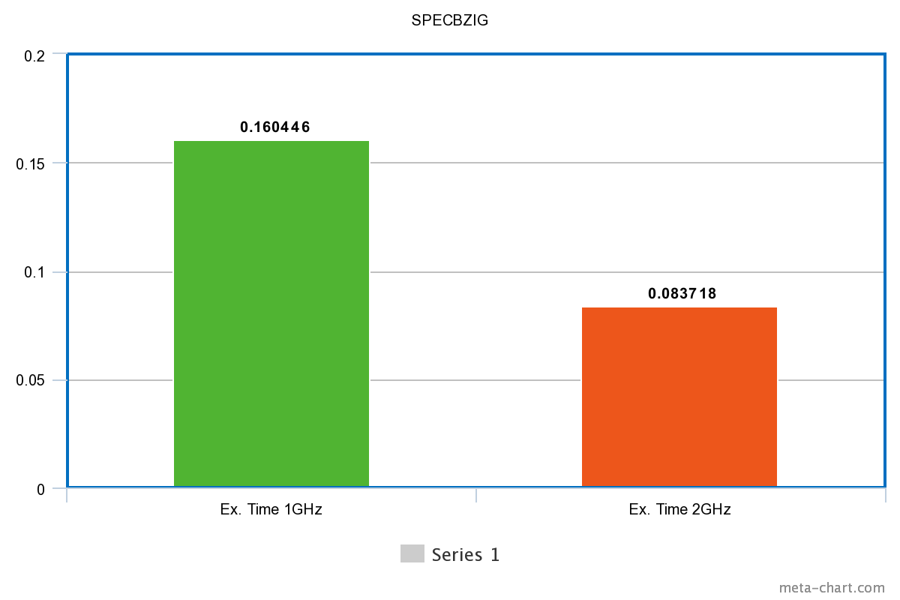

# Computer Architecture Lab 2

## Ομάδα 11
### Καλαντζής Γεώργιος 8818 gkalantz@ece.auth.gr
### Κοσέογλου Σωκράτης 8837 sokrkose@ece.auth.gr

Σκοπός της συγκεκριμένης εργασίας είναι η προσομοίωση μερικών bentchmarks στο gem5, η σύγκριση των αποτελεσμάτων τους καθώς και η αλλαγή διάφορων παραμέτρων του συστήματος έτσι ώστε να προσπαθήσουμε να βελτιστοποιήσουμε την απόδοση του.


#### Ερώτημα 1

Στο πρώτο ερώτημα θα βρούμε κάποιες από τις παραμέτρους του συστήματος μας. Πιο συγκεκριμένα θα βρούμε τις παραμέτρους των Caches που χρησιμοποιεί το μοντέλο MinorCPU κατά την εκτέλσεση των 5 benchmarck τα οποία μελετάμε σε αυτή την εργασία.

Αρχικά, το script _se.py_ κατά την μοντελοποίηση του κάθε bentchmark πέρνει ώς ορίζματα τα `--cpu-type = MinorCPU --caches --l2cahce` το οποίο δηλώνει ότι θα χρησιμοποιήσουμε το αρκετά εξελιγμένο μοντέλο MinorCPU το οποίο χρησιμοποιεί τεχνικές _pipeline_, με κλασικές caches και χρησιμοποιεί μέχρι και Level 2 Cache. Εξετάζοντας το script _se.py_ βλέπουμε ότι κάνει import το script **options.py** το οποίο ορίζει τα default values των Caches σε περίπτωση που δεν τα δώσουμε εμείς ως ορίσματα. Παρακάτω φαίνεται το τμήμα του κώδικα που επιτελεί αυτή την λειτουργία.

```ruby
    # Cache Options
    parser.add_option("--external-memory-system", type="string",
                      help="use external ports of this port_type for caches")
    parser.add_option("--tlm-memory", type="string",
                      help="use external port for SystemC TLM cosimulation")
    parser.add_option("--caches", action="store_true")
    parser.add_option("--l2cache", action="store_true")
    parser.add_option("--num-dirs", type="int", default=1)
    parser.add_option("--num-l2caches", type="int", default=1)
    parser.add_option("--num-l3caches", type="int", default=1)
    parser.add_option("--l1d_size", type="string", default="64kB")
    parser.add_option("--l1i_size", type="string", default="32kB")
    parser.add_option("--l2_size", type="string", default="2MB")
    parser.add_option("--l3_size", type="string", default="16MB")
    parser.add_option("--l1d_assoc", type="int", default=2)
    parser.add_option("--l1i_assoc", type="int", default=2)
    parser.add_option("--l2_assoc", type="int", default=8)
    parser.add_option("--l3_assoc", type="int", default=16)
    parser.add_option("--cacheline_size", type="int", default=64)
```

Τα παραπάνω μπορούμε να τα επιβεβαιώσουμε και από τα αποτελέσματα των προσομοιώσεων και συγκεκριμένα μέσα στο αρχείο config.ini, όπως φαίνεται παρακάτω.

```ruby
[system]
cache_line_size=64
..
[system.cpu.dcache]
assoc=2
data_latency=2
mshrs=4
response_latency=2
size=65536          # 65536/1024 = 64 -> 64kBytes
tag_latency=2
..
[system.cpu.icache]
assoc=2
data_latency=2
mshrs=4
response_latency=2
size=32768          # 32768/1024 = 32 -> 32kBytes
tag_latency=2
..
[system.l2]
assoc=8
data_latency=20
mshrs=20
response_latency=20
size=2097152        # 2097152/1024 = 2048 = 2*1024 -> 2MBytes
tag_latency=20
```

Συνοπτικά,

| Caches        | L1 Instr. Cache| L1 Data Cache  | L2 Cache        |
| ------------- | -------------  | -------------  | -------------   |
| Resp. latency | 2              | 2              | 20              |
| Tag   latency | 2              | 2              | 20              | 
| Data  latency | 2              | 2              | 20              |
| Associetivity | 2              | 2              | 16              | 
| Miss Stat. Reg.| 4             | 4              | 8               |
| Size          | 64kB           | 32kB           | 2MB             |


#### Ερώτημα 2

Στο ερώτημα αυτό θα καταγράψουμε κάποια από τα βασικά αποτελέσματα των διαφορετικών benchmarks. Πιο συγκεκριμένα θα καταγράψουμε τον χρόνο εκτέλεσης, τα CPI καθώς και τα miss rates, τα οποία είναι και οι πιο σημαντικές μετρικές αξιολόγησης της απόδοσης ενός συστήματος.

Παρακάτω βλέπουμε τα αποτελέσματα stats.txt του εκάστοτε benchmark.

**SPECMCF**
```ruby
sim_seconds                                  0.064937                       # Number of seconds simulated
system.cpu.committedInsts                   100000000                       # Number of instructions committed
system.cpu.cpi                               1.298734                       # CPI: cycles per instruction
system.cpu.idleCycles                        13385466                       # Total number of cycles that the object has spent stopped
system.cpu.numCycles                        129873417                       # number of cpu cycles simulated
system.cpu.dcache.overall_miss_rate::total   0.002079                       # miss rate for overall accesses
system.cpu.icache.overall_miss_rate::total   0.023610                       # miss rate for overall accesses
system.l2.overall_miss_rate::total           0.055082                       # miss rate for overall accesses
```

**SPECBZIG**
```ruby
sim_seconds                                  0.083718                       # Number of seconds simulated
system.cpu.committedInsts                   100000000                       # Number of instructions committed
system.cpu.cpi                               1.674353                       # CPI: cycles per instruction
system.cpu.idleCycles                        34708666                       # Total number of cycles that the object has spent stopped
system.cpu.numCycles                        167435346                       # number of cpu cycles simulated
system.cpu.dcache.overall_miss_rate::total   0.014248                       # miss rate for overall accesses
system.cpu.icache.overall_miss_rate::total   0.000077                       # miss rate for overall accesses
system.l2.overall_miss_rate::total           0.295243                       # miss rate for overall accesses
```

**SPECLIBM**
```ruby
sim_seconds                                  0.174771                       # Number of seconds simulated
system.cpu.committedInsts                   100000000                       # Number of instructions committed
system.cpu.cpi                               3.495428                       # CPI: cycles per instruction
system.cpu.idleCycles                       232191409                       # Total number of cycles that the object has spent stopped
system.cpu.numCycles                        349542816                       # number of cpu cycles simulated
system.cpu.dcache.overall_miss_rate::total   0.060972                     # miss rate for overall accesses
system.cpu.icache.overall_miss_rate::total   0.000093                     # miss rate for overall accesses
system.l2.overall_miss_rate::total           0.999944                       # miss rate for overall accesses
```

**SPECHMMER**
```ruby
sim_seconds                                  0.000061                       # Number of seconds simulated
system.cpu.committedInsts                       15136                       # Number of instructions committed
system.cpu.cpi                               8.020943                       # CPI: cycles per instruction
system.cpu.idleCycles                           93669                       # Total number of cycles that the object has spent stopped
system.cpu.numCycles                           121405                       # number of cpu cycles simulated
system.cpu.dcache.overall_miss_rate::total   0.055729                     # miss rate for overall accesses
system.cpu.icache.overall_miss_rate::total   0.095053                     # miss rate for overall accesses
system.l2.overall_miss_rate::total           0.937422                       # miss rate for overall accesses
```

**SPECSJENG**
```ruby
sim_seconds                                  0.513811                       # Number of seconds simulated
system.cpu.committedInsts                   100000001                       # Number of instructions committed
system.cpu.cpi                              10.276223                       # CPI: cycles per instruction
system.cpu.idleCycles                       805933933                       # Total number of cycles that the object has spent stopped
system.cpu.numCycles                       1027622265                       # number of cpu cycles simulated
system.cpu.dcache.overall_miss_rate::total   0.121831                       # miss rate for overall accesses
system.cpu.icache.overall_miss_rate::total   0.000020                       # miss rate for overall accesses
system.l2.overall_miss_rate::total           0.999972                       # miss rate for overall accesses
```

Συνοπτικά,

|               | SPECMCF        | SPECBZIG       | SPECLIBM        | SPECHMMER       | SPECSJENG       |
| ------------- | -------------  | -------------  | -------------   | -------------   | -------------   |
| Execution Time| 0.064937       | 0.083718       | 0.174771        | 0.000061        |  0.513811       |
| CPI           | 1.298734       | 1.674353       | 3.495428        | 8.020943        | 10.276223       | 
|DCache Miss Rate| 0.002079      | 0.014248       | 0.060972        | 0.055729        | 0.121831        |
|ICache Miss Rate| 0.023610      | 0.000077       | 0.000093        | 0.095053        | 0.000020        | 
|L2Cache Miss Rate| 0.055082     | 0.295243       | 0.999944        | 0.937422        | 0.999972        |


#### Ερώτημα 3

Στο ερώτημα αυό θα αλλάξουμε την συχνότητα χρονισμού του επεξεργαστή (**CPU**) για κάθε benchmark, έτσι ώστε να παρατηρήσουμε και να κατανοήσουμε τις επιπτώσεις που θα έχει αυτή η αλλαγή. Στην εκφώνηση της εργασίας, ζητείται να αλλάξουμε την συχνότητα της cpu από την _default_ σε **2GHz**. Παρ' όλα αυτά, όπως φαίνεται και παρακάτω η default τιμή της CPU CLOCK είναι ήδη 2GHz, συνεπώς η προσθήκη του cmdarg (--cpu-clock=2GHz) δεν θα είχε κανένα impact στην προσομοίωση μας. Έτσι, επιλέξαμε να μεταβάλουμε την default συχνότητα που είναι 2GHz σε 1GHz, έτσι ώστε να μποέσουμε να παρατηρήσουμε τις αλλαγές που θα επιφέρει στο κάθε bentchmark η αλλαγή της συχνότητας. Άρα, προσθέσαμε το argument (**--cpu-clock=1GHz**).

Ανοίγοντας, ενα οποιδήποτε stats.txt file απο τα 5 benchmarks μπορούμε να βρούμε σημαντικές πληροφορίες για τις τιμές των ρολογιών της CPU αλλά και του συστήματος. Οι πληροφορίες αυτές φαίνονται παρακάτω:

```ruby
..
system.clk_domain.clock                          1000                       # Clock period in ticks
..
system.cpu_clk_domain.clock                      1000                       # Clock period in ticks
..
```

Το **system.clk_domain.clock** είναι η συχνότητα ρολογιού του **συστήματος** ενώ το **system.cpu_clk_domain.clock** είναι η συχνότητα ρολογιού της **CPU**. Τόσο η συχνότητα της CPU όσο και η συχνοτητα του συστήματος είναι **1GHz**, αφού η περίοδος είναι 1000 ticks (1 tick = 1 picosecond), δηλαδή είναι **1ns**. Η συχνότητα ρολογιού της CPU χρονίζει όλα τα ψηφιακά συστήματα στοεσωτερικό του επεξεργαστή. Δηλαδή χρονίζει την ALU, την Control Unit καθώς και τις Level 1 και Level 2 Caches οι οποίες βρίσκονται στο εσωτερικό της CPU. Η συχνότητα του συστήματος χρονίζει τα περιφερειακά συστήματα και πιο συγκεκτριμένα στο μοντέλο _System-Call Emulation (SE)_, χρονίζει την μνήμη RAM (ή αλλιώς DRAM, αφου αποτελείτε κυρίως απο DRAM,σε αντίθεση με τις Caches οπου αποτελούνται απο SRAM). 

Για να επιβεβαιώσουμε αυτά που είπαμε παραπάνω μπορούμε να δούμε τα συγκεκριμένα αποτελέσματα του confings.ini.

```ruby
[system.clk_domain]
type=SrcClockDomain
clock=1000
domain_id=-1
eventq_index=0
init_perf_level=0
voltage_domain=system.voltage_domain
..
[system.cpu_clk_domain]
type=SrcClockDomain
clock=1000
domain_id=-1
eventq_index=0
init_perf_level=0
voltage_domain=system.cpu_voltage_domain
..
[system.cpu]
clk_domain=system.cpu_clk_domain
..
[system.cpu.dcache]
clk_domain=system.cpu_clk_domain
..
[system.cpu.icache]
clk_domain=system.cpu_clk_domain
..
[system.dvfs_handler]
sys_clk_domain=system.clk_domain
..
[system.l2]
clk_domain=system.cpu_clk_domain
..
[system.mem_ctrls]
clk_domain=system.clk_domain
..
[system.mem_ctrls.dram]
clk_domain=system.clk_domain
..
[system.membus]
clk_domain=system.clk_domain
..
[system.tol2bus]
clk_domain=system.cpu_clk_domain
..
```

Όπως βλεπουμε και από το config.ini, αυτά τα οποία είπαμε παραπάνω επιβεβαιώνονται καθώς τα dcache, icache, l2cache, cpu χρονίζονται με **system.cpu_clk_domain** το οποίο είναι η συχνότητα CPU, ενώ η DRAM χρονίζεται με το **system.clk_domain**, δηλαδή την συχνότητα του συστήματος. Αυτό που επίσης παρατηρούμε είναι ότι το κύκλωμα το DVFS Handler (Dynamic Voltage-Frequency Handler) της CPU (δηλαδή η αυξομείωση της τάσης και της συχνότητας της CPU ανάλογα με τον "φόρτο εργασίας") χρονίζεται με την συχνότητα του συστήματος, πράγμα το οποίο είναι και λογικό αφού χρειάζεται μια σταθερή συχνότητα (System Frequency) για να μεταβάλει την συχνότητα της CPU (CPU Frequency) ώστε να μειώσει και τις απώλειες Joule όταν δεν υπάρχει μεγάλη ανάγκη επεξεργαστικής ισχύς.

Αν προσθέσουμε άλλον έναν επεξεργαστή, **λογικά** η συχνότητα χρονισμού του θα είναι η συχνότητα της CPU (CPU Frequency). Στην πραγματικότητα όμως δεν είναι απαραίτητο όλοι οι processors ενός συστήματος να τρέχουν στην ίδια συχνότητα, καθώς υπάρχουν και πολυπύρηνοι επεξεργαστές, όπως οι **big.LITTLE** της ARM που έχουν δυο είδη επεξεργαστών, εναν _LITTLE processor_ ο οποίος είναι σχεδιασμένος για power efficiency και τρέχει σε μικρότερες συχνότητες και εναν _big processor_ ο οποίος τρέχει σε μεγαλύτερες συχνότητες και είναι σχεδιασμένος για υψηλά υπολογιστικά φορτία.

Ας πάμε λοιπόν να συγκρίνουμε τα αποτελέσματα του προηγούμενου ερωτήματος που έγιναν με **2GHz** CPU Frequency, με αυτά που έτρεξαν με **1GHz** CPU Frequency.

Συνοπτικά, τα αποτελέσματα των προσομοιώσεων με **1GHz** είναι ως εξης:

|               | SPECMCF        | SPECBZIG       | SPECLIBM        | SPECHMMER       | SPECSJENG       |
| ------------- | -------------  | -------------  | -------------   | -------------   | -------------   |
| Execution Time| 0.127888       | 0.160446       | 0.262250        | 0.000086        |  0.705456       |
| CPI           | 1.278885       | 1.604463       | 2.622500        | 5.683272        | 7.054557        |
|DCache Miss Rate| 0.002079      | 0.014124       | 0.060971        | 0.055718        | 0.121831        | 
|ICache Miss Rate| 0.023625      | 0.000077       | 0.000093        | 0.095117        | 0.000020        |
|L2Cache Miss Rate| 0.055082     | 0.295238       | 0.999944        | 0.937422        | 0.999972        |


